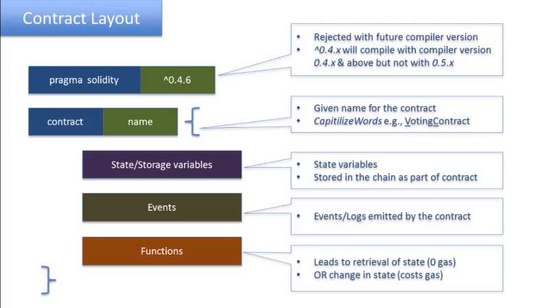
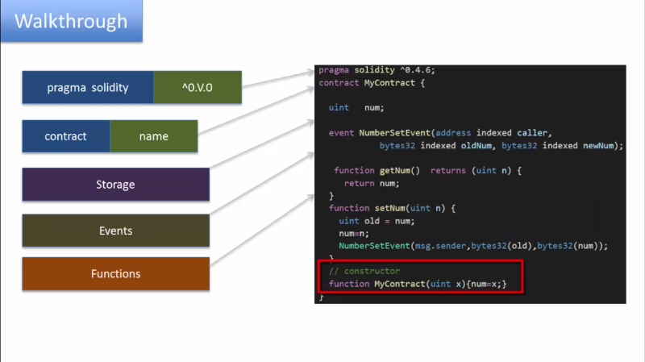

# Solidity

Solidity es el lenguaje de programación más popular para programar contratos inteligentes en Ethereum.
Al parecer sigue un poco los lineamientos de EC6, aunque tiende a desviarse un poco.

Solidity es un lenguaje estático. Eso quiere decir que, al declarar una variable, tiene que declararse su tipo.

Un contrato es un objeto, por lo que es declarado como tal. 
En ese sentido es parecido a Java, aunque este uso sea mucho más intuitivo.
Se puede interpretar al código como la clase y al contrato ya subido al EVM como la instancia del objeto.
Siento que esto es estirar el concepto de OOP. Sobretodo porque, en teoría, solo subirías una vez el contrato a la red.
A menos que se refiera a que, cada vez que la cuenta contrato es activada, se crea una instancia del contrato y se ejecuta.
Esto tendría más sentido, pero el storage del contrato siempre es 

Los contratos pueden invocarse (llamar desde otro archivo fuente), crearse (declaración estándar) o heredarse.

## Diseño de un contrato

El diseño de un contrato es relativamente sencillo. 



He aquí un ejemplo con código.



A continuación una explicación de cada uno de los elementos.

### Versión del compilador

### Nombre del contrato

### Storage Variables

Cuando hablábamos de los elementos de las cuentas contratos, se decía que esta tenía, además de una dirección y un saldo de ether, un contrato y un almacenamiento, o Storage.
Resulta que este Storage puede ser especificado dentro de los contratos inteligentes. 
En este caso, el storage es solo un entero, pero no está limitado a solo un tipo de dato, el Storage puede ser los números y tipos de variables que se desee.
Puede considerarse a estas variables como las que se quiere que perduren más allá de una ejecución.
Usualmente, para que esto suceda en un lenguaje de programación tradicional tenemos que lidiar con el sistema de archivos o con bases de datos.
No aquí, hasta donde tengo entendido.

> Las variables declaradas de forma estándar fuera de funciones son automáticamente consideradas State o Storage Variables.
> Esta es una forma conveniente pero riesgosa, ya que las variables globales cuestan gas, puesto que están escribiéndose en la blockchain.

*GEth tiene una base datos, LevelDB. Leí que ahí era donde se almacenaban todas las State Variables (Variables de Estado).

### Eventos

### Funciones

#### Constructores

## Importar, heredar y declarar contratos

Múltiples contratos pueden ser declarados en un solo archivo. El último contrato es el que es 'deployed' en la blockchain.

```
pragma solidity ^0.4.20;

contract Account {
    // Represents an account
}

contract CreditAccount is Account {
    // Is type of an account
}
```

La importación de contratos puede ser a través de archivos locales, direcciones HTTP e incluso GitHub.
Pero este grado de libertad depende del compilador.

```
pragma solidity ^0.4.20;

import "./Account.sol";

contract CreditAccount is Account {
    // Is type of an account
}
```

# Tipo de datos

Solidity también tiene estructuras, es uno de los primeros ejemplos en la documentación oficial.

## Tipos elementales (primitivos)

### Value types

Los tipos de datos Bool y Number (Integer) son consideradas Value Type porque siempre se pasan por valor cuando están como argumento de una función o cuando son usadas para asignar un valor a otra variable.
Ignoro como sería para modificar un state uint si este es el caso.

```
int num1; // Inicializado en 0, int256 por default
uint8 num2; // Inicializado en 0, 8 - 256
bool flag; // Inicializado como falso
```

#### Address

Las direcciones tienen su propio tipo de datos. Son 20 bytes que representan una dirección (2^160).
Lo que diferencia a los address de algún int o uint es que las primeras poseen miembros y métodos.

address owner;

owner.balance

Retorna el balance en wei

owner.transfer(10)
owner.send(10)

En teoría sirve para lo mismo. 
En realidad se lee como 'transferir 10 Wei a Owner'.
Está implícito que los Wei salen del balance de la cuenta contrato, no olvidar que estas cuentas también poseen un saldo.

## Conversión de datos

Hay tres formas: Implicit, explicit, deduced.

### Implicit

Permitido (no hay errores de compilación) si es que no hay pérdida de información. Bool e Int no son intercambibles.

```
int8 x8 = 2;
int16 x16 = 2;
x8 = x16; // ok
x16 = x8; // bad
```

### Explicit

Un typecasting de rutina. 

```
int32 x32 = 20;
int24 x24 = x32; /** bad **/
int24 x24 = int24(x32); // ok
```

### Deduction

El compilador puede inferir el tipo. Creo que esto desvirtúa el hecho de que sea un lenguaje estático, pero bueno.

```
var someVar= x32;
```
